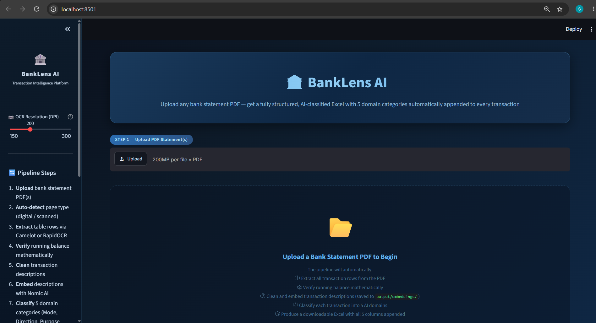
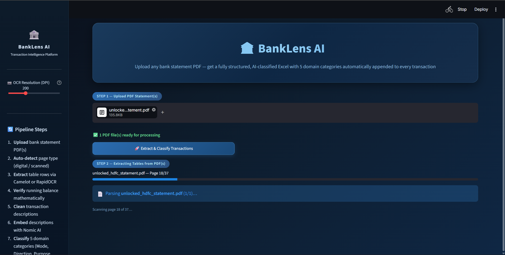
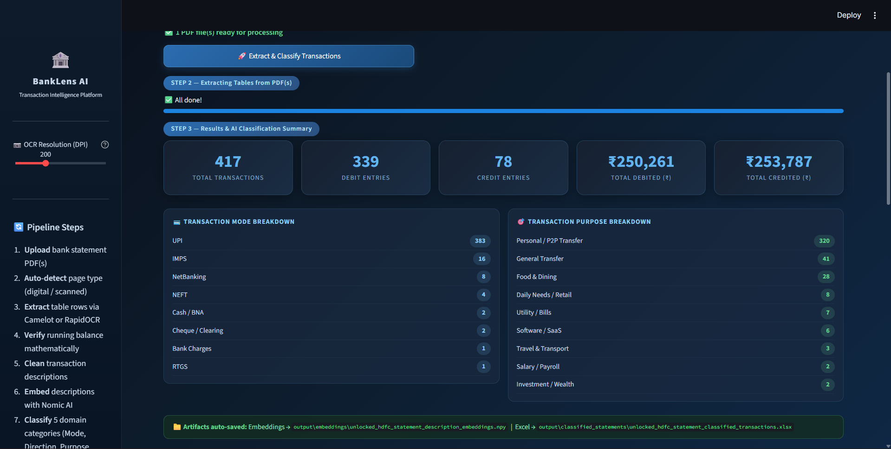
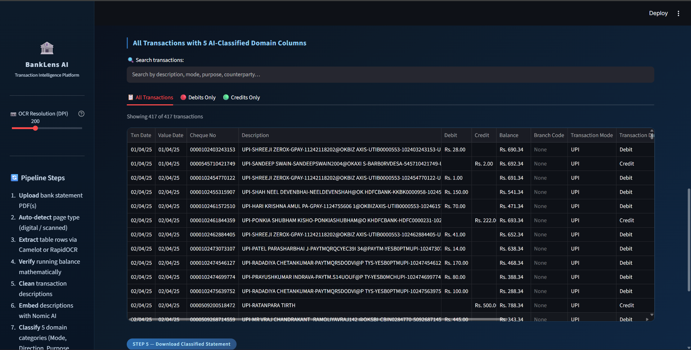
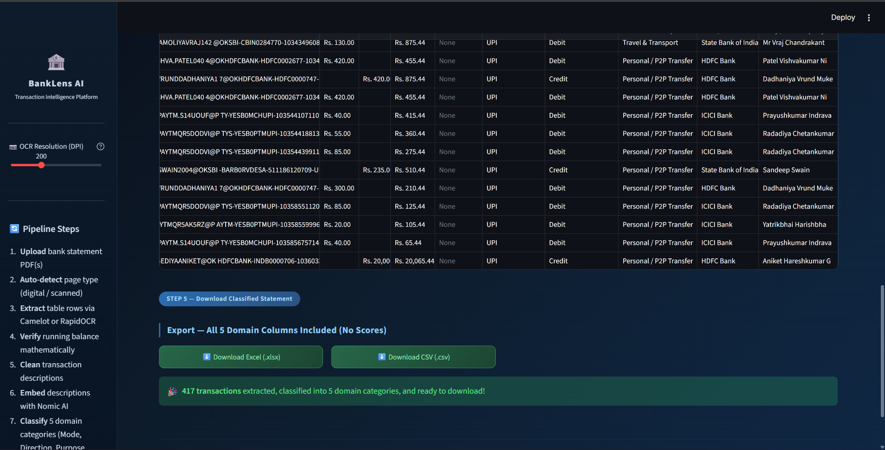

# 🏦 Bank Statement Intelligence — PDF Extraction & Transaction Classification

[](https://www.python.org/downloads/)
[](https://streamlit.io/)
[](https://camelot-py.readthedocs.io/)
[-brightgreen.svg)](https://github.com/RapidAI/RapidOCR)
[](https://huggingface.co/nomic-ai/nomic-embed-text-v1.5)

---

## What This Does

Uploads a bank statement PDF → extracts every transaction → classifies it across 5 dimensions → exports to Excel/CSV. Runs fully locally, no cloud APIs, no LLMs.

Built as a Streamlit web app.

---

## 🖥️ Application Preview

### Landing & Upload


### Extraction in Progress


### Financial Summary & Category Breakdown


### Classified Transaction Ledger


### Export to Excel / CSV


> 📂 Sample output (417 rows, HDFC Bank): [`output/classified_statements/unlocked_hdfc_statement_classified_transactions.xlsx`](output/classified_statements/unlocked_hdfc_statement_classified_transactions.xlsx)

---

## Table of Contents

1. [What This Does](#what-this-does)
2. [Application Preview](#️-application-preview)
3. [Design Constraints](#design-constraints)
4. [How It Was Built — Phase by Phase](#how-it-was-built--phase-by-phase)
5. [Phase 1 — PDF Extraction](#phase-1--pdf-extraction)
6. [Phase 2 — OCR for Scanned PDFs](#phase-2--ocr-for-scanned-pdfs)
7. [Phase 3 — Description Cleaning](#phase-3--description-cleaning)
8. [Phase 4 — TF-IDF Clustering (EDA)](#phase-4--tf-idf-clustering-eda)
9. [Phase 5 — Embedding Clustering (EDA)](#phase-5--embedding-clustering-eda)
10. [Phase 6 — Final Classification Engine](#phase-6--final-classification-engine)
11. [Counterparty Extraction](#counterparty-extraction)
12. [Retraining Pipeline](#retraining-pipeline)
13. [Repository Structure](#repository-structure)
14. [Setup & Running Locally](#setup--running-locally)

---

## Design Constraints

- Accept PDFs from multiple banks with different column layouts
- Support both **digital PDFs** and **scanned image PDFs**
- **No LLMs allowed** — classification had to use heuristics or traditional ML
- Export results as `.xlsx` and `.csv`

The no-LLM constraint was the key design driver. It forced a deterministic approach: regex rules for clear patterns + local embeddings for ambiguous ones.

---

## How It Was Built — Phase by Phase

```
Phase 1 ── PDF Extraction      pdfplumber broke on multi-line cells → switched to Camelot
Phase 2 ── OCR Support         2 of 5 PDFs were scanned images → built RapidOCR pipeline
Phase 3 ── Cleaning            Raw narrations full of IFSC codes, UTR IDs → cleaning pipeline
Phase 4 ── EDA (TF-IDF)        Confirmed descriptions have natural cluster structure
Phase 5 ── EDA (Embeddings)    Validated semantic grouping; K=8 mapped to real banking categories
Phase 6 ── Classifier          5-domain engine with pattern rules + embeddings + confidence gating
```

All exploratory scripts, notebooks, and cluster plots are preserved in `experiments/` as a record of the process.

---

## Phase 1 — PDF Extraction

### Why pdfplumber failed

`pdfplumber` treats each visual line as a separate row. Bank statement descriptions wrap across 2–4 lines, so a single transaction would split into 3 rows with amounts in the wrong places.

### Why Camelot works

Camelot uses OpenCV to detect grid lines and reads the table as a proper 2D cell grid. Multi-line descriptions stay inside their correct cell. It returns a clean Pandas DataFrame.

### 3 Bank Layout Schemas

Different banks print statements in different column formats. The system auto-detects the schema from the table header and parses accordingly — no manual config needed.

| Schema | Column layout | Banks |
|--------|--------------|-------|
| **Schema HDFC** | `Date` · `Narration` · `Chq/Ref` · `Value Dt` · `Withdrawal Amt` · `Deposit Amt` · `Closing Balance` | HDFC Bank |
| **Schema A** | `Txn Date` · `Value Date` · `Cheque No` · `Description` · `Branch Code` · `Debit` · `Credit` · `Balance` | Velocity, Prosperity, Metropolitan |
| **Schema B** | `No` · `Transaction ID` · `Value Date` · `Txn Posted Date` · `Cheque No` · `Description` · `Cr/Dr` · `Amount` · `Balance` | INDUSBANK, Unity National |

Schema HDFC uses `Withdrawal Amt` / `Deposit Amt` column names instead of `Debit` / `Credit`, and has no `Cr/Dr` flag — it required its own parser separate from Schema A and B.

---

## Phase 2 — OCR for Scanned PDFs

Some PDFs have no embedded text (scanned images). For these, a separate pipeline runs:

1. **Render page** at 300 DPI using PyMuPDF
2. **RapidOCR** extracts word tokens with bounding box coordinates `[x, y, x2, y2]`
3. **Row grouping** by Y-axis proximity — words close in vertical position form one row
4. **Column assignment** using header X-coordinates as slot boundaries
5. **Multi-line stitching** — description-only rows are merged into the row above

**Why RapidOCR over Tesseract:** Returns bounding boxes (not flat text), runs via ONNX locally, more accurate on printed fonts.

Auto-detection: if a page has fewer than 80 characters of embedded text, it routes to OCR. Otherwise, Camelot.

---

## Phase 3 — Description Cleaning

Raw narrations look like this:

```
NEFT-CNRBR946608852502-HDFC0004171-RAMESH VORA-/NONE
```

The useful content is `NEFT` and `RAMESH VORA`. Everything else is noise. The cleaning pipeline strips:
- IFSC codes (`HDFC0004171`)
- UTR / reference numbers (`CNRBR946608852502`)
- Bank boilerplate (`/NONE`, `SENT-TRANSFER FROM`, phone numbers)
- OCR-split words are rejoined using known prefix patches

After cleaning:
```
NEFT - RAMESH VORA
```

---

## Phase 4 — TF-IDF Clustering (EDA)

TF-IDF + K-Means (K=2, 4, 8) was run to understand the natural structure of the data before building any classifier.

**At K=4, the clusters were clean:**

| Cluster | % | What it contains |
|---------|---|-----------------|
| 0 | 65% | UPI, NEFT, RTGS, salary transfers |
| 1 | 21% | Cheque clearing, MICR, interbank |
| 2 | 11% | ATM cash, BNA deposits |
| 3 | 3% | Header rows pulled in as data (extraction artifact) |

Finding cluster 3 directly caused the cleaning pipeline to be built.

**Why clustering alone isn't enough:** Cluster IDs are anonymous integers, unstable across runs. They also can't represent that one transaction simultaneously has a mode, direction, purpose, bank, and counterparty.

Scatter plots archived in [`experiments/clustering_artifacts/images/`](experiments/clustering_artifacts/images/).

---

## Phase 5 — Embedding Clustering (EDA)

TF-IDF can't handle synonyms — `"ATM WDL"` and `"Cash Withdrawal"` land in completely different positions because they share no tokens.

`nomic-embed-text-v1.5` (768-dim, 8192-token context) encodes semantic meaning so synonyms converge regardless of exact wording. At K=8, the dense clusters aligned clearly with banking categories: salary, ATM, cheque, utility, P2P, etc.

This confirmed that named exemplar prototypes per category would work better than unsupervised cluster IDs — leading directly to the final engine.

Scatter plots archived in [`experiments/clustering_artifacts/images/`](experiments/clustering_artifacts/images/).

---

## Phase 6 — Final Classification Engine

### Why 5 Domains?

A single narration like:
```
UPI CR - HDFC BANK - SALARY TRF - CONSUMER PRODUCTS INDIA
```
contains four independent facts: **Mode** (UPI), **Direction** (Credit), **Purpose** (Salary), **Counterparty** (Consumer Products India). A single label throws away most of the information.

### The 5 Domains

| Domain | Categories |
|--------|-----------|
| **Transaction Mode** | `UPI` · `NEFT` · `RTGS` · `IMPS` · `ATM` · `Cash / BNA` · `Cheque / Clearing` · `NetBanking` · `Bank Charges` |
| **Transaction Direction** | `Debit` · `Credit` |
| **Transaction Purpose** | `Personal / P2P Transfer` · `Food & Dining` · `Salary / Payroll` · `Rent / Lease` · `Software / SaaS` · `Utility / Bills` · `Bank Charges` · `Investment / Wealth` · `Healthcare / Medical` · `Daily Needs / Retail` · `ATM Withdrawal` · `Travel & Transport` |
| **Bank / Institution** | `HDFC Bank` · `ICICI Bank` · `SBI` · `Axis Bank` · `Citi Bank` · `Kotak Mahindra` · `Bank of Baroda` · `Clearing House (MICR)` · `Branch BNA` |
| **Party / Counterparty** | Dynamically extracted — open-ended |

### How Classification Works

1. **Pattern Matching**: Direct rules match known keywords (e.g. `SALARY`, `ZOMATO`, `ATM WDL`) and identify peer-to-peer transfers from UPI narrations (`UPI-<NAME>-<vpa>@<bank>`).
2. **Semantic Similarity**: Ambiguous descriptions are converted to dense vectors using `nomic-embed-text-v1.5` and matched against category prototypes using cosine similarity.
3. **Confidence Threshold**: If the top similarity score is below `0.75`, the transaction defaults to `"General Transfer"` instead of guessing.

---

## Counterparty Extraction

Counterparties are infinite (any person or shop), so a static vocabulary can't work. The extractor instead:

1. Parses `UPI-<NAME>-<vpa>@<bank>` narrations to isolate the name
2. Strips IFSC codes, VPA handles, and reference numbers from NEFT/RTGS narrations
3. Cross-references a `KNOWN_ENTITIES` dictionary for corporate names
4. Returns `SELF` for ATM / BNA / internal transfers

Output: clean, title-cased names like `Sandeep Swain`, `Shreeji Zerox`, `Consumer Products India`.

---

## Retraining Pipeline

[`new_training_data.py`](new_training_data.py) re-generates the embedding prototypes from new statement PDFs:

```bash
# Drop new PDFs into training_data/
python new_training_data.py
# App picks up new embeddings on next launch
```

- Creates a timestamped backup before overwriting vectors (auto-restores on failure)
- Filters low-quality tokens before embedding (`_is_quality_exemplar`)
- Works across all 3 schema formats

---

## Repository Structure

```
.
├── app.py                      # Streamlit application (entry point)
├── classify_pipeline.py        # 5-domain classification engine
├── new_training_data.py        # Embedding retraining pipeline
├── requirements.txt
├── packages.txt
│
├── assets/                     # UI screenshots
├── embedding_class/            # Cached prototype vectors (auto-generated on first run)
├── output/classified_statements/   # Sample classified output
│
└── experiments/                # EDA notebooks, clustering scripts, archived outputs
    ├── notebooks/
    ├── model_experiments/
    ├── clustering_artifacts/
    └── experiment_outputs/
```

> Binary embedding files (`*.npz`, `*.npy`) and raw PDFs are git-ignored. The app auto-generates embeddings on first launch.

---

## Setup & Running Locally

**Prerequisite:** Install [Ghostscript](https://www.ghostscript.com/download/gsdnld.html) and add its `bin/` to your PATH (required by Camelot).

```bash
git clone https://github.com/sudarshan0999/Transaction-Classifier.git
cd Transaction-Classifier

python -m venv .venv
.venv\Scripts\activate          # Windows
# source .venv/bin/activate     # Linux / macOS

pip install -r requirements.txt
streamlit run app.py
```

Open `http://localhost:8501`. On first run, embeddings are auto-generated (~5 seconds). No other setup needed.

---

## Tech Stack

| Layer | Tech |
|-------|------|
| Web app | Streamlit |
| PDF extraction | Camelot-py + OpenCV |
| PDF rendering | PyMuPDF |
| OCR | RapidOCR (ONNX) |
| Embeddings | nomic-embed-text-v1.5 via sentence-transformers |
| Data | Pandas · NumPy · scikit-learn |
| Export | openpyxl |
